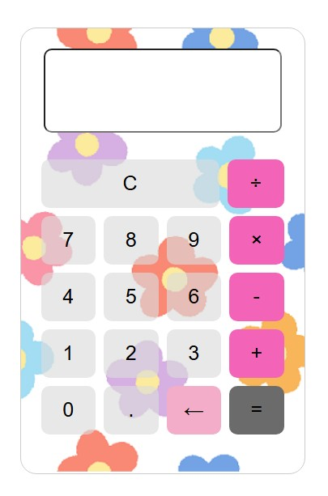

# シンプル電卓
このアプリは、「JavaScript製電卓アプリ」です。基本的な四則演算（足し算・引き算・掛け算・割り算）に対応し、視覚的にもわかりやすい UI を実現しています。

 

# 概要
- C（クリア）機能
- ←（1文字削除）機能
- 0除算や無効入力時の Error 表示
- 負の数や連続演算（例：6×-3）に対応

# 使用技術
- HTML5
- CSS3（Flexbox, 背景画像）
- JavaScript（ES6クラスベース）

# クレジット
このアプリは以下をベースに作成・改変しています：

- オリジナルコード：
　JavaScript オブジェクト指向電卓（[taraoblog.com](https://taraoblog.com/javascript-oop-calculator/)）

- コード改善協力：
　ChatGPT（[OpenAI](https://openai.com/chatgpt)） のアドバイスを元に機能追加・修正を行いました。

- 花柄イラスト素材：
　ツカッテ(https://tsukatte.com/flower-pattern-01/)

# デモページ

GitHub Pages にホスティングしている場合はこちら：

👉 [電卓を使ってみる](https://sato200411.github.io/calculator/)  

# インストール方法

1. このリポジトリをクローン：

   git clone https://github.com/sato200411.github.io/calculator.git

